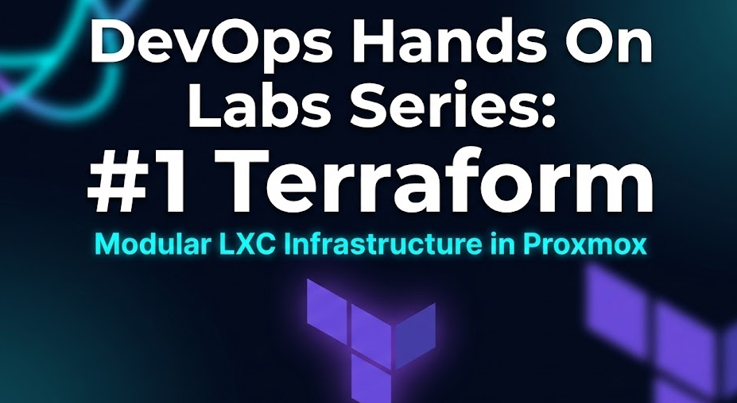

# 🚀 Desplegando una infraestructura con Terraform y Proxmox

## 1. Introducción: El Problema del "SysAdmin Artesano"

Si eres de los que configura servidores entrando por SSH, instalando paquetes a mano y luego rezando para que nadie toque nada porque no te acuerdas exactamente de qué configuración tocaste en `/etc/`, este artículo es para ti. Estamos hablando del **"SysAdmin Artesano"**: aquel que mima cada servidor como si fuera una pieza única de joyería.

El problema es que las joyas son difíciles de escalar y imposibles de replicar si se rompen. Aquí es donde entra **Terraform** y el cambio de mentalidad radical: vamos a dejar de tratar nuestros servidores como **"Mascotas"** (Pets) a las que ponemos nombre y cuidamos con mimo, para tratarlos como **"Ganado"** (Cattle). Si un servidor falla, no lo arreglas; lo destruyes y despliegas uno nuevo idéntico en segundos usando código.

---

## 2. Teoría: La Anatomía de Terraform (Conceptos Clave)

Antes de tocar el teclado, visualiza estas piezas. Terraform no es magia, es una orquesta bien organizada:

*   **El Provider (El Traductor):** Terraform habla su propio idioma (HCL). Proxmox habla a través de una API. El Provider es el traductor que permite que Terraform le diga a Proxmox: "Crea esto".
*   **El Módulo (`modules/`):** Es el **Molde** o Plano Maestro. No es un servidor real, es la definición genérica de cómo se hace uno. "Todos mis LXC deben tener esta estructura".
*   **Las Variables (`variables.tf`):** Es el **Contrato**. Aquí dices qué ingredientes necesitas (RAM, IP, CPU), pero no les das valor todavía. Es el compromiso de que "alguien" dará esos datos.
*   **El Main (`main.tf`):** Es la **Fábrica**. Aquí es donde coges el Molde (Módulo) y le inyectas los datos para crear recursos reales.
*   **El TFVars (`terraform.tfvars`):** La **Hoja de Pedido**. Es el único archivo que deberías tocar en tu día a día. Aquí pones los valores reales (IP: 192.168.1.50).
*   **El State (`terraform.tfstate`):** La **Memoria**. Es un archivo donde Terraform anota qué ha construido. Si lo pierdes, Terraform se vuelve "amnésico" y no sabrá que esos servidores existen.

---

## 3. El Proyecto: "La Factoría de Contenedores"

Nuestro objetivo es desplegar una arquitectura modular en Proxmox con dos tipos de contenedores:

1.  **LXC VPN (srv-basico):** Un contenedor ligero para una función específica. Sin complicaciones.
2.  **LXC Docker (srv-docker-prod):** Una máquina potente preparada para el futuro. Tiene **Nesting** (para que Docker corra dentro del LXC) y **Bind Mounts** (discos del host mapeados) para que los datos sobrevivan si el contenedor muere.

---

## 4. Desarrollo Paso a Paso

### Paso A: Estructura de Directorios
Lo primero es organizar nuestra oficina. Así debe verse tu carpeta de trabajo:

```bash
.
├── main.tf                 # Orquestador principal
├── providers.tf            # Conexión con Proxmox
├── terraform.tfvars        # Tus datos (IPs, Passwords)
├── variables.tf            # Declaración de variables root
└── modules/
    └── lxc_basic/          # El Módulo Universal
        ├── main.tf
        ├── outputs.tf
        └── variables.tf
```

### Paso B: El Provider (`providers.tf`)
**Explica:** Aquí le decimos a Terraform que use el plugin de Telmate para hablar con Proxmox y definimos las credenciales de acceso.

```hcl
terraform {
  required_providers {
    proxmox = {
      source  = "telmate/proxmox"
      version = "2.9.14" # Versión estable recomendada
    }
  }
}

provider "proxmox" {
  pm_api_url      = var.pm_api_url
  pm_user         = var.pm_user
  pm_password     = var.pm_password
  pm_tls_insecure = true # Ignora certificados auto-firmados
  pm_parallel     = 1    # Evita bloqueos en la API de Proxmox
}
```

### Paso C: El Módulo Universal (`modules/lxc_basic/main.tf`)
**Explica:** Este es el cerebro. Fíjate en el bloque `dynamic "mountpoint"`, que permite añadir discos solo si se solicitan, y en `features`, vital para que Docker funcione dentro de un LXC.

```hcl
resource "proxmox_lxc" "generic" {
  target_node  = var.target_node
  hostname     = var.hostname
  vmid         = var.vmid
  ostemplate   = var.ostemplate
  password     = var.password
  unprivileged = true
  start        = true
  
  cores  = var.cores
  memory = var.memory
  swap   = 512
  
  rootfs {
    storage = "local-lvm"
    size    = var.disk_size
  }

  network {
    name   = "eth0"
    bridge = var.vmnet
    ip     = var.ip_address
    gw     = var.gateway
  }

  ssh_public_keys = var.ssh_key

  features {
    nesting = var.docker_enabled # Permite Docker-in-LXC
    keyctl  = var.docker_enabled # Necesario para gestión de claves en Docker
  }

  # Crea mountpoints dinámicamente si la lista no está vacía
  dynamic "mountpoint" {
    for_each = var.mountpoints
    content {
      key     = mountpoint.value["key"]     # Índice interno (ej: "0")
      slot    = mountpoint.value["slot"]    # ID del slot (ej: 0)
      storage = mountpoint.value["storage"] # Ruta en el host Proxmox
      mp      = mountpoint.value["mp"]      # Ruta destino en el LXC
      size    = mountpoint.value["size"]    # "0G" para Bind Mounts
      volume  = mountpoint.value["storage"] # Necesario para Bind Mounts
    }
  }
}
```

### Paso D: Las Variables del Módulo (`modules/lxc_basic/variables.tf`)
**Explica:** Aquí definimos qué "ingredientes" acepta nuestro molde. Algunos tienen valores por defecto para que el módulo sea fácil de usar.

```hcl
variable "target_node" {}
variable "vmid" {}
variable "hostname" {}
variable "ip_address" {}
variable "password" {}
variable "ssh_key" {}
variable "ostemplate" {}

variable "cores"  { default = 1 }
variable "memory" { default = 512 }
variable "disk_size" { default = "1G" }
variable "gateway" { default = "192.168.1.1" }
variable "vmnet"  { default = "vmbr0" }

variable "docker_enabled" { 
  description = "Activa nesting y keyctl"
  default = false 
}

variable "mountpoints" {
  description = "Lista de discos/bind mounts"
  type = list(object({
    key     = string
    slot    = number
    storage = string
    mp      = string
    size    = string
  }))
  default = [] # Por defecto, sin discos extra
}
```

### Paso E: El Orquestador (`main.tf` root)
**Explica:** Aquí es donde ocurre la magia. Llamamos al mismo módulo dos veces con configuraciones totalmente distintas. 

```hcl
# LXC SIMPLE: Solo le pasamos lo mínimo, el resto lo pone el default del módulo
module "lxc_wireguard" {
  source      = "./modules/lxc_basic"
  target_node = var.proxmox_host
  vmid        = var.basic_id
  hostname    = "srv-basico"
  ip_address  = var.basic_ip
  ostemplate  = var.template_name
  password    = "passwordTemporal"
  ssh_key     = var.ssh_key_public
  gateway     = var.global_gateway
}

# LXC AVANZADO: Sobrescribimos RAM, Cores y activamos Docker con un Bind Mount
module "lxc_docker_full" {
  source         = "./modules/lxc_basic"
  target_node    = var.proxmox_host
  vmid           = var.adv_id
  hostname       = "srv-docker-prod"
  ip_address     = var.adv_ip
  ostemplate     = var.template_name
  password       = "passwordTemporal"
  ssh_key        = var.ssh_key_public
  gateway        = var.global_gateway
  vmnet          = var.adv_bridge
  cores          = var.adv_cores
  memory         = var.adv_ram
  disk_size      = "10G"
  docker_enabled = true 
  
  # El Puente. Aunque el módulo espera una lista, nosotros 
  # la construimos aquí usando las variables planas del .tfvars.
  # Así el usuario final no tiene que pelear con sintaxis compleja.
  mountpoints = [
    {
      key     = var.adv_mount_key
      slot    = var.adv_mount_slot
      storage = var.adv_mount_storage
      mp      = var.adv_mount_mp
      size    = var.adv_mount_size
    }
  ]
}
```

### Paso F: Los Datos (`terraform.tfvars`)
**Explica:** ¡El centro de control! Hemos "aplanado" las variables complejas. El módulo es capaz de manejar múltiples discos (vía listas), pero para este lab le pasamos los datos de uno solo de forma sencilla. Es limpio y fácil de leer.

```hcl
# --- GLOBALES ---
proxmox_host     = "tu_nodo_proxmox"
pm_api_url       = "https://tu-ip:8006/api2/json"
pm_user          = "root@pam"
pm_password      = "tu_pass_secreta"

# --- NETWORKING ---
global_gateway   = "192.168.1.1"
adv_bridge       = "vmbr1001"

# --- LXC DOCKER (Avanzado) ---
adv_id           = "901"
adv_ip           = "192.168.1.51/24"
adv_ram          = "2048"
adv_cores        = 2

# --- BIND MOUNT (Persistencia) ---
# Aquí es donde ocurre el puente: usamos variables planas para simplificar el .tfvars
adv_mount_key     = "0"
adv_mount_slot    = 0
adv_mount_storage = "/raid1/storage/nginx_data" # Carpeta en el Proxmox
adv_mount_mp      = "/var/www/html"             # Carpeta en el LXC
adv_mount_size    = "0G"                        # 0G = Bind Mount
```

---

## 5. Despliegue y Comandos

Ahora que tienes todo listo, es hora de que Terraform haga su trabajo. Abre tu terminal en la carpeta principal:

1.  `terraform init`: Terraform descargará el Provider de Proxmox.
2.  `terraform plan`: **¡Vital!** Mira la consola. Verás líneas con un **`+` verde**. Eso significa que Terraform va a crear esos recursos. Si todo está correcto, procede.
3.  `terraform apply`: Escribe `yes`. En menos de 60 segundos, tus dos LXC estarán creados y arrancados en Proxmox.

---

## 6. Cierre y Reto

Felicidades. Has dejado de dar clics para empezar a dar órdenes. Ya no eres un artesano, ahora eres un arquitecto de infraestructura.

**El Reto Final:**
Edita tu archivo `terraform.tfvars`. Cambia `adv_ram` de 2048 a 4096. Guarda el archivo y ejecuta de nuevo `terraform apply`. 
Verás que Terraform no destruye la máquina, simplemente **actualiza** la memoria en caliente. ¡Ese es el poder de la infraestructura declarativa!

---
🚀 **¿Qué sigue?** En el Lab 2 usaremos estas máquinas preparadas para automatizar el despliegue de Docker usando **Ansible**.

📂 **Repositorio del proyecto:** [DevOps Labs](blank)
